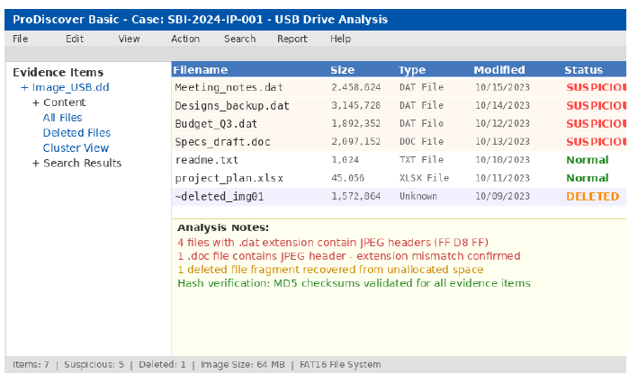
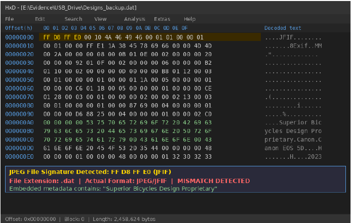
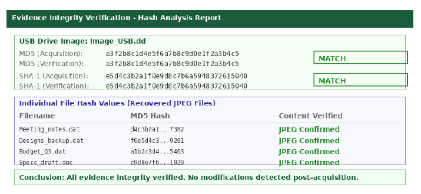
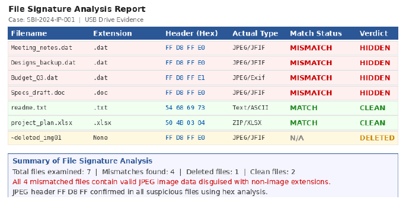

# Digital Forensics Investigation: Intellectual Property Theft

## Overview

This project presents a digital forensics investigation into a simulated intellectual property theft involving USB storage media and email communications. The investigation focused on identifying concealed evidence, recovering hidden information, and analysing digital artefacts to determine how confidential company data was accessed and transferred.

The case study demonstrates the application of standard digital forensics methodologies, including evidence examination, file signature analysis, and email investigation.

> **Portfolio Note:** This project is based on an academic case study and is presented here to demonstrate practical digital forensics investigation, technical analysis, and forensic reporting skills.

---

## Objectives

- Examine a forensic USB image
- Detect disguised and hidden files
- Analyse email evidence
- Perform file signature analysis
- Document forensic findings
- Produce a structured investigation report

- ---

## Tools Used

| Tool | Purpose |
|------|---------|
| ProDiscover Basic | Examination of the USB forensic image |
| HxD / WinHex | File header and hexadecimal analysis |
| File Signature Analysis | Identification of disguised file types |
| Email Header Analysis | Examination of email communication and metadata |

---

## Investigation Methodology

The investigation followed a structured digital forensics process:

1. Examined the forensic USB drive image.
2. Analysed the directory structure and stored files.
3. Verified file headers using hexadecimal analysis.
4. Identified files with mismatched extensions through file signature analysis.
5. Recovered hidden JPEG image files.
6. Examined email communications for evidence of data exfiltration.
7. Correlated USB evidence with email findings.
8. Documented the investigation and conclusions.

---

## Key Findings

The investigation identified several indicators of intellectual property theft:

- Multiple files were intentionally disguised by changing their file extensions.
- File signature analysis revealed JPEG files hidden behind non-image extensions.
- Recovered images contained proprietary bicycle design information.
- Email communications indicated the possible transfer of confidential company data.
- Correlation between USB evidence and email records supported the investigation findings.

---

## Skills Demonstrated

- Digital Forensics Investigation
- USB Drive Analysis
- File Signature Analysis
- Hexadecimal Analysis
- Email Header Analysis
- Digital Evidence Examination
- Incident Investigation
- Technical Documentation
- Digital Evidence Reporting

---

## Project Report

The complete digital forensics investigation report is available in the repository.

📄 **Report:** [Digital-Forensics-Investigation-Report.pdf](docs/Digital-Forensics-Investigation-Report.pdf)

---

## Investigation Screenshots

### USB Drive Analysis

---

### Evidence Examination

---

### Hash Analysis Report

---

### Analysis Report

---

## References

## References

1] C. Altheide and H. Carvey, Digital Forensics with Kali Linux. Waltham, MA, USA: 
Syngress, 2011. 
[2] B. Carrier, File System Forensic Analysis. Boston, MA, USA: Addison-Wesley, 
2005. 
[3] E. Casey, Digital Evidence and Computer Crime: Forensic Science, Computers 
and the Internet, 3rd ed. Waltham, MA, USA: Academic Press, 2011. 
[4] K. Kent, S. Chevalier, T. Grance, and H. Dang, Guide to Integrating Forensic 
Techniques into Incident Response, NIST Special Publication 800-86. Gaithersburg, 
MD, USA: National Institute of Standards and Technology, 2006. doi: 
10.6028/NIST.SP.800-86. 
[5] B. Nelson, A. Phillips, and C. Steuart, Guide to Computer Forensics and 
Investigations, 6th ed. Boston, MA, USA: Cengage Learning, 2019. 
[6] Scientific Working Group on Digital Evidence, SWGDE Best Practices for 
Computer Forensics, Version 3.1, 2018. [Online]. Available: 
https://www.swgde.org/documents/published

---

## Disclaimer

This project is based on an academic digital forensics case study and has been adapted for portfolio purposes. It demonstrates digital forensics investigation techniques, evidence analysis, and technical reporting skills.

